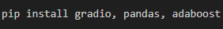
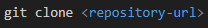
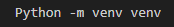
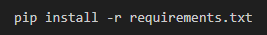
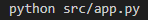
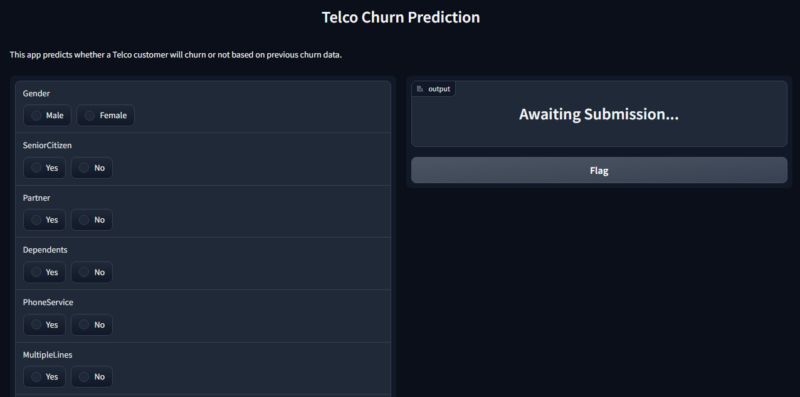
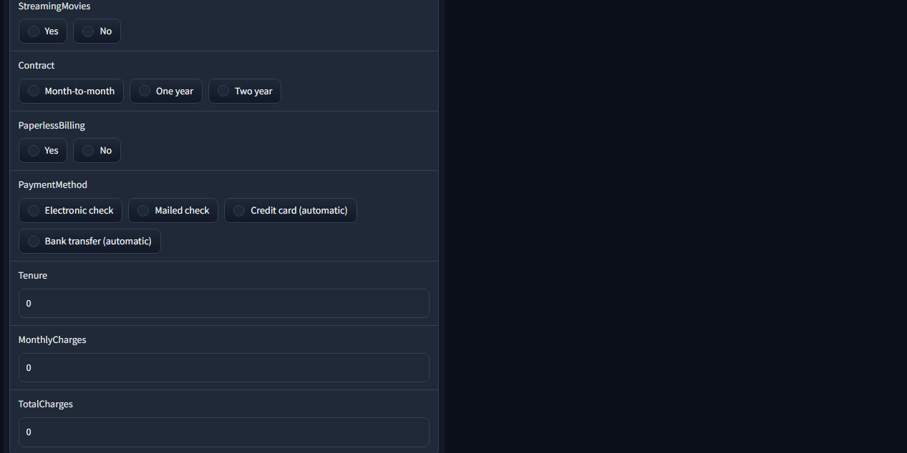
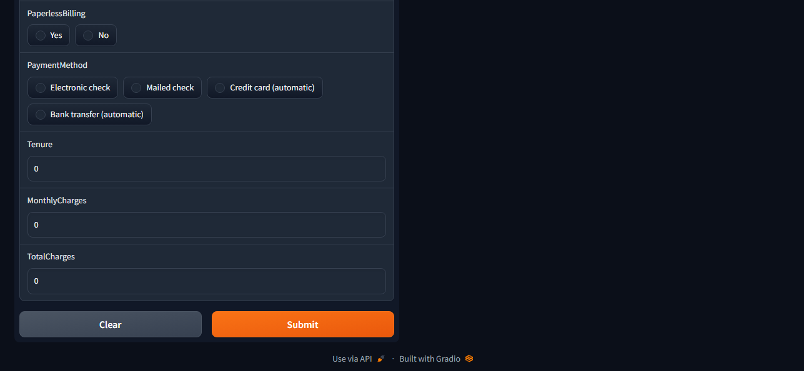

# Embed Telco Churn ML Model To Gradio 📲

Welcome to the **Telco Churn Prediction App Project** for embedding a Machine Learning model to Gradio. The mission is to develop an app to predict whether a Telecom customer will churn or not.

## Prerequisites 📈

Ensure that you install the following libraries in your Python environment or virtual environment:

* Gradio
* Pandas
* Adaboost

The libraries can be installed using the following command:

## Setup ⚙️

To set up and run the Streamlit app in your local environment, follow these instructions:

1. Clone this repository to your local machine using the following command. Replace \<repository-url\> with the actual url to this repository:

2. Create and activate a virtual environment:

3. Install requirements.txt:

4. Run the app using the following command:

The app will be launched in your default web browser and can then be used to make predictions based on the customer information provided.

## Preview 🔍

## Author 👨‍💼

| Name                | LinkedIn                                                                                                                                                                                                                                   | Medium Article |
| ------------------------ | ------------------------------------------------------------------------------------------------------------------------------------------------------------------------------------------------------------------------------------------ | ----------- |
| Chidiebere David Ogbonna | [Chidiebere David Ogbonna](https://www.linkedin.com/in/chidieberedavidogbonna/) |[Building an Interactive Telco Churn Prediction App with Gradio and Hugging Face](https://eberedavid.medium.com/embedding-telco-churn-machine-learning-model-in-gradio-1fb9df22d4a2)|
|                          |                                                                                                                                                                                                                                            |        |

## Features

**Churn Prediction**: The app allows users to input the customer information. It can then predict using the Adaboost model from the Machine Learning components.

**Interactive Interface**: Gradio provides an interactive, easy-to-use, web-based interface.

## Model Training and Saving 🤖

The Adaboost model was trained using the telecom dataset of Vodafone as shown in this GitHub repository: [Telco-Churn-Analysis](https://github.com/iameberedavid/Telco-Churn-Analysis). Here is a Medium article explaining the process: [TELCO CHURN ANALYSIS](https://eberedavid.medium.com/telco-churn-analysis-d463035fcbb5).

## Usage Instructions 🧑‍🏫

Input Fields: The app displays input fields for the customer information.
Prediction: Click the "Submit" button to get a prediction based on the provided inputs.
Results: The app will display whether the customer will churn or not based on the customer data in the input field.

## Acknowledgments 🙏

I would like to express my gratitude to the [Azubi Africa Data Analyst Program](https://www.azubiafrica.org/data-analytics) for their support and for offering valuable projects as part of this program. Not forgeting my scrum masters on this project [Rachel Appiah-Kubi](https://www.linkedin.com/in/racheal-appiah-kubi/) & [Emmanuel Koupoh](https://github.com/eaedk)

## License 📜

This project is licensed under the MIT License - see the [LICENSE.md](LICENSE.md) file for details.

## Contact 📧

For questions, feedback, and collaborations, please contact [Chidiebere David Ogbonna](eberedavid326@gmail.com).